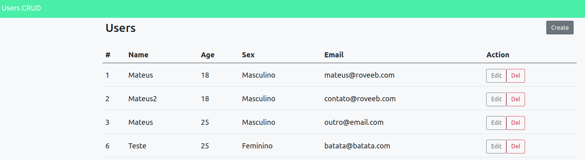
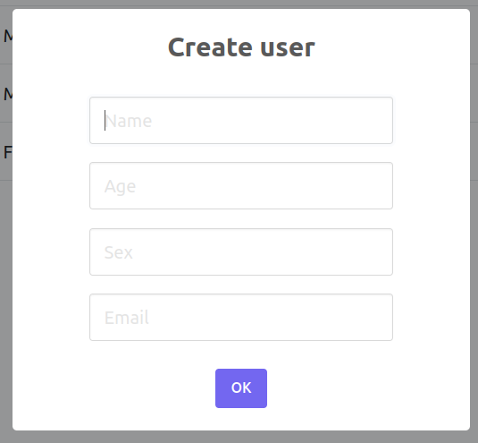
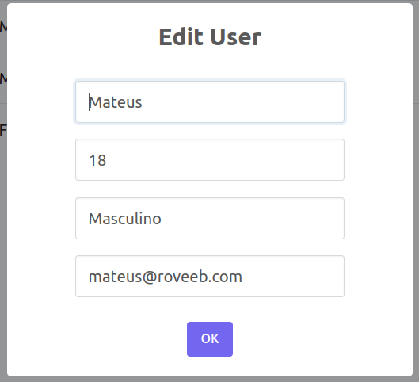

# CRUD com API + frontend

O exemplo presente nesse repositório contém um frontend que consome a [API criada em aula](https://github.com/christianbayer/crie_ti-cwia-t1/tree/main/aula9), um sistema de login implementado em [Login com javascript](https://github.com/CRIETI/aplicacoes-web-client-server-step-2/tree/main/aula8-crud-js-login) e Mestre Detalhe, implementado em [Mestre detalhe](https://github.com/CRIETI/aplicacoes-web-client-server-step-2/tree/main/aula9-mestre-detalhe).

O consumo é feito através do AXIOS e o frontend possui algumas bibliotecas para deixar o visual mais agradável.


## Como executar

Para o projeto funcionar, a API deve ser iniciada e depois executado o frontend

### API

Acesse o diretório api

```
cd api
```

Crie o arquivo `.env` com base no `.env.example`
```
cp .env.example .env
```

Utilize o editor de sua preferência para preencher os valores das variáveis de ambiente

Instale os pacotes do NodeJS
```
npm install
```

Executar a API
```
npm run serve
```

Na primeira vez, executar o seeder de usuário para criar o usuário inicial. O comando abaixo criará um usuário automaticamente.
```
npx sequelize-cli db:seed:all
```
### Frontend
No front, basta editar o arquivo `endpoint.js`, na primeira linha, colocando o endpoint da sua API. No caso, está configurado para usar o `http://localhost:3000/`

```javascript
const ENDPOINT = "http://localhost:3000";
```

Como utilizamos o local storage, precisamos de um servidor para abrir os arquivos, afinal pelo `file` haverão problemas.

Entrar na pasta front
```
cd front
```

Instalar os pacotes
```
npm install
```

Executar o servidor frontend
```
npm run serve
```

Acessar [http://localhost:8080](http://localhost:8080)

- E-mail: mateus@mateus.com
- Senha: 12345


## Prints do projeto


